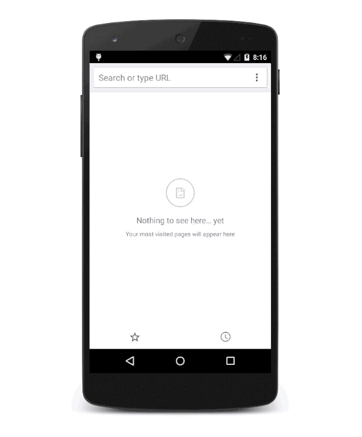
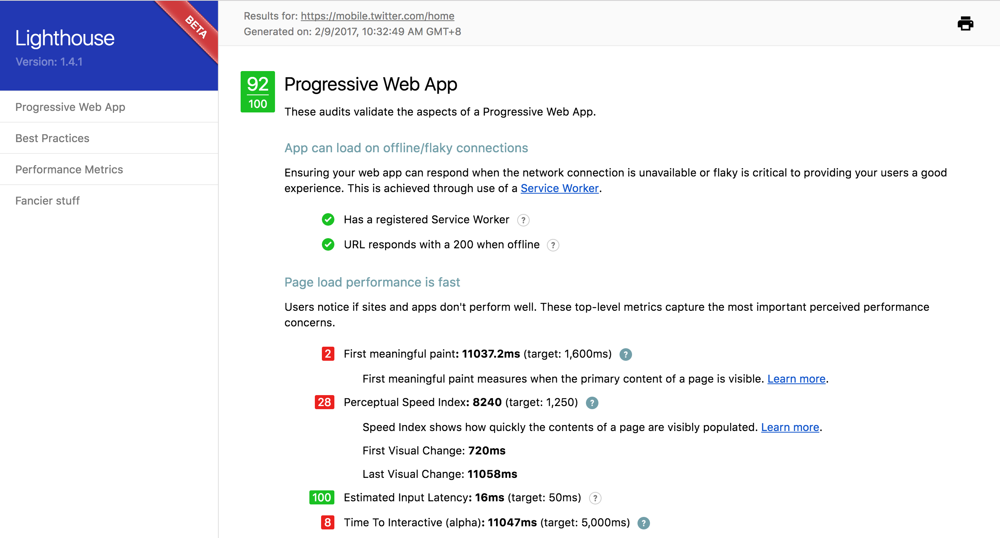

# 熟悉api写法

## 引子

https://twitter.com/necolas/status/829128165314306048

> 推特的工程师Nicolas，发文说：Today we moved all of Twitter's mobile web traffic (that's like, a lot) to our new web stack – Node.js, Express, React PWA.

本来这是一篇普通的推文，但在Node.js和大前端圈里一下就火起来了，作为2017年后的第一个大事件，正在备受瞩目。

- Twitter移动端网址流量都已经切换到了新的技术站，这个技术站是国内都在观望的，Twitter可以说是成了第一个吃螃蟹的人
- React PWA是很新很潮的技术，在2016年出来就曾引起热潮，但真正落地的没有几家，大部分人都在观望
- Twitter作为知名网址，一直是技术风向标，对于国内喜欢找【参照物驱动开发】的人来说，一定是个大新闻

可能读者，对这个Twitter新的技术栈不是特别了解，我在这里试着给大家科普一下，主要包括Node.js、Express和React PWA，中间会穿插对移动的一些看法，期望能够对家有用。

## PWA

[PWA](https://developers.google.com/web/progressive-web-apps/) 的全称是 Progressive Web App，是 Google 在2015年提出，2016年6月才推广开来的想法。具体的意思就是在移动端利用提供的标准化框架，在网页应用中实现和原生应用相近的用户体验。

总而言之，它说到底还是一个网页应用，只不过通过最新的技术手段实现了某些以前原生应用才有的功能。


优点：

1. 后台加载：引入Service Worker概念，即使网页关闭仍然可以在后台运行获取数据更新（只能更新小部分数据有限制）
2. 消息推送：用户允许，即使网页关闭后依然可以接受到系统通知栏推送
3. 原生应用界面：可以隐藏浏览器本身的所有视觉部分，光光从UI和UX上面看,用户会很容易认为这就是一个原生界面
4. 离线使用：离线浏览
5. 桌面图标：只要配置一个图标，应用就能生成快捷方式在桌面上，结合上面的效果基本能和原生相对比。
6. 无需安装
7. 优雅降级、渐进增强

缺点：兼容问题，所以大家都是观望


PWA的理论跟微信小程序的理论完全一致：创业公司完全没必要招原生开发者，只需要一套PWA或者微信小程序即可。最后胜出者应该是微信小程序，除非谷歌能逆袭


官方的gif效果演示



- 大小，其本质是一个网页，没有原生app的各种启动条件，快速响应用户指令；
- 缓存，以前app是全是在线，为了优化才做的离线缓存，现在的pwa是全是离线，如果向发起网络请求还要额外配置
- 消息推送 – 也就是推送消息的能力，在pwa被关闭的时候，其实是保留有后台进程的，可以接收发送来的通知，不过默认使用的是GCM(Google cloud-messaging)，大天朝就
- 可添加到主屏幕 – 可以将app的快捷方式放置到桌面上，全屏运行，与原生app无异，连启动图（splash screen）都一样


由于这些都是“优雅降级、渐进增强” 的，给支持的设备更好的体验，不支持的设备也不会更差。

> Chrome团队希望用实际的产品要告诉用户，PWA就是那个体验跟App一样好，但是都不用你安装的网页应用

## 看一下twitter的使用效果

在构建PWA时，有很多质量检查项要做，列表如下：

- 在offline/flaky网络连接下，App能够加载，并且页面加载非常快 App can load on offline/flaky connections and page load performance is fast
- App采用渐进增强(Progressive Enhancement)的原则来构建 App is built using Progressive Enhancement principles
- App使用HTTPS作为安全通信协议 App is using HTTPS for secure communications
- 提示用户添加到Home screen   Users will be prompted to Add to Home screen
- 已安装的web应用会加载自定义的启动图，并且地址栏会匹配 Installed web app will launch with Custom Splash Screen and address bar will match brand colours

为了确认是否满足上面的需求，你需要一个名为Lighthouse的工具规范的标准。

[Lighthouse](https://github.com/GoogleChrome/lighthouse) 是一个开源的审核工具，，你可以用它来测试和改进你的网页。它会跑很多测试并生成页面效果报告。你可以以[Chrome扩展](https://chrome.google.com/webstore/detail/lighthouse/blipmdconlkpinefehnmjammfjpmpbjk?hl=en)或使用Node.js CLI工具的方式来安装Lighthouse


```
$ npm install -g lighthouse
```

看一下效果

```
$ lighthouse https://mobile.twitter.com/home
```

会生产一个mobile.twitter.com_2017-02-09_10-32-49.report.html 的报告，在浏览器中打开即可

lighthouse给出评价是`92%`，可以说是非常优秀了。而http://m.alibaba.com获得是98%。




## 应用外壳

说白了就是第一次渲染渲个壳、等异步数据来了再填充

An application shell (or App Shell) is the minimal HTML, CSS and JS responsible for providing the user with the shell of the user interface. A toolbar is a good example of something that would be encapsulated in this shell. In a PWA, the App Shell can be cached so it loads as quickly as possible when a user decides to return to the webpage. With this, we can provide the user with something meaningful immediately even if the actual content has not rendered yet.


We can see that the App Shell in this application just consists of a header, navigation and loading icon that shows while the content is being fetched over the network. To cache our shell in order to load faster on repeat visits, we’ll need to add a Service Worker to our application.

## 你看不见的Proxy（Service Worker）

通过新API service-workers(相当于一个本地的proxy，采用JavaScript控制关联的页面或者网站，拦截并修改访问和资源请求)，使得的app能够在各种网络环境下使用，包括网络差和断网条件下，不会显示undefind；


增量更新


## 缓存(Service Worker Precache)

以前app是全是网络请求，为了优化才做的离线缓存，现在的pwa是全是离线，如果向发起网络请求还要额外配置

既 HTML5 AppCache （Application Cache） 的失败之后，Service Worker 标准中提供了更加灵活的 Cache API ，加上新的 Response/Request API 可以完全控制客户端缓存。 这无疑提供了完整的离线 API。

Cache API 提供了 CacheStorage 接口来操作缓存（在 Service Worker Scope 中为 caches 对象）。 可以配合 Service Worker 生命周期完成离线优先的缓存机制：

A Service Worker Boilerplate:

```js
self.addEventListener('install', (event) => {
  // Perform install steps
})

self.addEventListener('fetch', (event) => {
 // Handle requests
})

self.addEventListener('activate', (event) => {
  // Clean up old cache versions
})
```

- 在 install 时使用 .keys() 获取所有缓存键并使用 .delete() 来清理过期的缓存。
- 在 active 时使用 .add() 和 .addAll() 来立即添加当前页面资源进缓存。
- 在 fetch 时使用 caches.put() 来更新缓存。

为了避免体验不一致，Service Worker 在 install 后不会立即 active ， 除非用户关闭了所有标签页，在调试时可以在 install 事件中调用 self.skipWaiting() 来强制 active 。

缓存 Response 时需要注意一个 Response 流只能被读一次，因此需要返回一份，同时 clone 一份放入缓存。

```
self.addEventListener('fetch', function(event) {
  event.respondWith(
    caches.open('mysite-dynamic').then(function(cache) {
      return cache.match(event.request).then(function (response) {
        return response || fetch(event.request).then(function(response) {
          cache.put(event.request, response.clone());
          return response;
        });
      });
    })
  );
});
```

上述代码来自 Jake 的 The Offline Cookbook 。 另外通过 Background Sync 可以让浏览器在下一次联网时发送消息而不需页面在运行。 典型的场景是：1. 断网了，2. 发送一条消息，3. 把手机装进口袋，4. 进入有网络的环境，5. 打开手机，消息早已发出去了！

## 配置文件

- iOS 有Info.plist
- Android有AndroidManifest.xml
- H5有 manifest属性制定xxx.appcache

那么，在PWA中呢？

[web app manifest](https://developers.google.com/web/updates/2014/11/Support-for-installable-web-apps-with-webapp-manifest-in-chrome-38-for-Android?hl=en)提供你的webapp的元数据。伴随service worker，你的web应用需要一个清单以便能够触发添加到主屏幕提示（在支持的浏览器里）

### 基本配置

Time to add decorations to the mix using a Manifest file. The Manifest gives the browser information about the app and how to style it outside the viewport.

The Manifest is included in the <head> of the HTML page:

```
<link rel="manifest" href="/manifest.json">
```

This is our current manifest.json file:

```
{
  "background_color": "#ffffff",
  "description": "It's what's happening. From breaking news and entertainment, sports and politics, to big events and everyday interests.",
  "display": "standalone",
  "gcm_sender_id": "49625052041",
  "gcm_user_visible_only": true,
  "icons": [
    {
      "src": "https://ma-0.twimg.com/twitter-assets/responsive-web/web/ltr/icon.a9cd885bccbcaf2f.png",
      "sizes": "192x192",
      "type": "image/png"
    }
  ],
  "name": "Twitter",
  "orientation": "portrait",
  "short_name": "Twitter",
  "start_url": "/",
  "theme_color": "#ffffff"
}
```

### 启动图 Splash Screen

- 设置icon图片和名称
- 设置背景色
- 设置主题色

跟app里的启动图不太一样，它以主题色或背景为背景，继而显示icon图。


自定义icons

```
  "icons": [
    {
      "src": "https://ma-0.twimg.com/twitter-assets/responsive-web/web/ltr/icon.a9cd885bccbcaf2f.png",
      "sizes": "192x192",
      "type": "image/png"
    }
  ],
```

### 消息推送

使用GCM服务（Google Cloud Messaging）来实现消息推送

```
  "gcm_sender_id": "49625052041",
  "gcm_user_visible_only": true,
```

### 屏幕方向

```
"orientation": "portrait",
```

### 自定义显示类型

如果你想让你的web应用隐藏浏览器的UI，你可以把display类型设置为standalone

````
"display": "standalone"
``

如果你认为用户更喜欢在浏览器把你的页面当成正常的网址的话，你可以把display类型设置为browser

``
"display": "browser"
``

更多参照：https://developers.google.com/web/fundamentals/engage-and-retain/web-app-manifest/

## 添加到主屏幕

像 App 一样添加到主屏，并全屏打开（不带任何浏览器 UI）对用户来讲可能是 PWA 最像 App 的地方。 为此你需要一个 manifest 文件关联到当前网页：

> <link rel="manifest" href="/manifest.json">

在 manifest.json 中可以设置这些类似 App 的特性。比如：

- short_name 显示为桌面图标文字（用户可在添加时定义）；
- name 显示在启动界面（Splash Screen）；
- start_url 用户刷新从桌面图标打开的页面时载入；
- icons ：最好包括一个 144x144 大小的 PNG 图标；

如果你设置了上述 Manifest 字段且拥有一个 service worker， 只要用户在5分钟内访问两次 Chrome 便会提示用户添加到主屏。 Chrome 的具体策略见 [increasing engagement with app install banners in chrome for android](https://developers.google.com/web/updates/2015/03/increasing-engagement-with-app-install-banners-in-chrome-for-android) 一文。

## PWA前景

如上所述，google在中国的技术推广挺痛苦的(只要跟google服务有关的)，google pwa在中国推广也有着诸多的困难：

- 中国apple用户众多,而现在apple不支持pwa;(这算是一个大问题)
- Chrome在中国桌面版占有率还是不错的，移动端上的占有率却很低；
- 各大厂商还未明确支持pwa，更不要说中国混乱的各种开发标准了（乱）
- 依赖的GCM服务在中国被呵呵（这个问题不大，推送服务不难）
- As of 2016, Progressive Web Apps are implemented in the Chrome browser, but more browsers may support the features needed in the future； -WIKI；
- 各路Android ROM中的浏览器早都已经被改的没有人形了，大家在支持PWA这件事情上肯定毫无兴趣 ——什么添加主屏，与我的利益毫不相关啊。
- 国内的Web环境非常复杂、首先是各种Webview，然后才轮得到浏览器。
- 国内的互联网公司大都“技术深厚”，各种黑科技大行其道，哪里轮得到PWA。

如上所述如微信等其他组织慢慢抢占这样的市场技术份额，当然从推广层面来说这是好事；


再看国外，PWA简直就是神器：

由于都是Google服务健全的Android设备，标配Chrome，PWA 一推，用户到达率简直直逼100%。
印度网差，下载一个App痛苦，一个可以“流式下载”的PWA在用户初次访问上就可以完爆Native App。
互联网环境还比较原始，大都直接亲Google，公司支持率也会非常高。

所以你看，AliExpress率先支持了PWA，但在国内，这一天不知道要等到猴年马月了。

## 推荐资料

- 开源项目 https://github.com/jeffposnick/create-react-pwa
- 更多示例 https://pwa.rocks/

参考资料

- https://developers.google.com/web/progressive-web-apps/
- https://developers.google.com/web/fundamentals/getting-started/primers/service-workers
- https://en.wikipedia.org/wiki/Progressive_web_app
- https://codelabs.developers.google.com/codelabs/your-first-pwapp
- http://digiday.com/platforms/wtf-progressive-web-apps/

## 搭车：Server-Side Render（SSR）

- 什么是服务端渲染
- 优点
- Why use Node.js？
- React && Vue

web端渲染的劣势

1.SEO 很多爬虫是不认的。
2.首次打开速度，各种加载 速度很慢。

由于这些问题twitter在11年的时候甚至把原来的客户端渲染改回了服务端渲染。

优势就是体验好

1. 各种原来服务器做的事情丢给客户端做了，减少开销。
2. 服务器端和客户端可以共享某些代码，避免重复定义。这样可以使结构更清晰，增加可维护性
3. 首次加载页面的速度加快。客户端渲染的一个缺点是，当用户第一次进入站点，此时浏览器中没有缓存，需要下载代码后在本地渲染，时间较长。而服务器渲染则是，用户在下载的已经是渲染好的页面了，打开速度比本地渲染快。
4. SEO。服务器端渲染可以让搜索引擎更容易读取页面的meta信息以及其他SEO相关信息，大大增加网站在搜索引擎中的可见度。


其实并不一定要争个好坏，服务器端和客户端渲染各有各的优缺点。建议根据实际需求，在某些页面使用服务器渲染，某些页面使用客户端渲染，以达到最佳解决方案。


React的虚拟DOM是其可被用于服务端渲染的关键。首先每个ReactComponent 在虚拟DOM中完成渲染，然后React通过虚拟DOM来更新浏览器DOM中产生变化的那一部分，虚拟DOM作为内存中的DOM表现，为React在Node.js这类非浏览器环境下的吮吸给你提供了可能，React可以从虚拟DoM中生成一个字符串。而不是跟新真正的DOM，这使得我们可以在客户端和服务端使用同一个React Component。
 
React 提供了两个可用于服务端渲染组件的函数：React.renderToString 和React.render-ToStaticMarkup。 在设计用于服务端渲染的ReactComponent时需要有预见性，考虑以下方面。
选取最优的渲染函数。
如何支持组件的异步状态。
如何将应用的初始化状态传递到客户端。
哪些生命周期函数可以用于服务端的渲染。
如何为应用提供同构路由支持。
单例、实例以及上下文的用法。


## 为什么Node.js还会继续火

- 0）Node.js作为基础工具已经无可替代
- 1) 蹭一波ssr + pwa热潮，node是大前端（泛指各种view层相关技术）最佳拍档
- 2）性能差不多的情况下，看的就是喜好，js基数大node就用户量就非常大，简单粗暴获得一个相当不错的性能
- 3）目前在proxy层基本普及了，但向后端和微服务部分还有很大发力空间，io密集的后端必有一席之位

